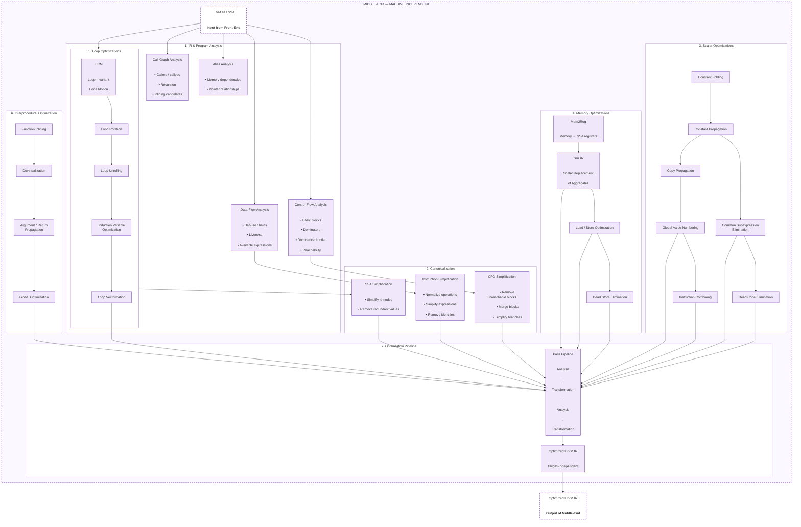

An overview of some of llvm's internals illustrating their usages and syntax.
 
 Categories
 - Attributes
 - linkages
 - Terminator instructions
 - Metadata
 - Debug Information
 
 For a complete reference of the IR, lookup [LLVM_IR](https://llvm.org/docs/LangRef.html)
 
 If you have been keen on the developmenents in the compiler tech world,
 you'll know that compiler infrastructure fundamentally boils down to MLIR.
 And no wonder, it eliminates the need to design various code generators that 
 necessarily need to be built for any language relying on its own custom IR.
 
 I do not think it can also be overstated how much utility it avails all in 
 a single codebase, especially the optimization  and verification 
 passes.

So this effort goes to explore how various high level language constructs get to be lowered to  
the IR.
 
## Examples
 
### SSA features 
 
 This instance show cases the constrains laid out by SSA 
  ```rust
  fn greater_than (a :u32, b: u32) bool {
      if  a > b {
          true
      }else{
          false
      }
  }
  
  
  fn main() {
      let mut a = 6;
      let mut b = 8;
      if greater_than(a, b) {
          a += 1
      }else{
          b += 1
      }
  }
 ```
 
This is a purely subjective view.
Static Single Assignment (SSA) is currently an approach  to help track definitions of variables and 
separate the need to track various reassignments to the same variables.

It's hard to exactly see the problem that this solves and why it lies at the core of the IR
but a little examination quickly illustrates why it is useful.

Compilers generally have to keep track of every variable used in an expression and 
their respective definitions. This is important because it needs to get a proper picture
of what exactly the program is doing in order to perform modifications without 
altering the observed behavior of the program or what is visible in the execution environment.

Basically all modifications no matter how radical ought to maintain the semantics of the program.

*I find the fact that we managed to do this a very impressive feat.*

So in order to generate efficient assembly or basically assembly that will simply not be highly improved 
when hand written, multiple analyses have to be performed on the program at several levels.
So the constrains put on the compiler writer are partly something they sign up to when designing the language 
features. So if you are writing in a dynamic language where you can reassign variables however, the challenge
is how to keep track of the changes in the variables in a way that maintains consistency as the variables are accessed and in use.
This is effectively similar to repeatedly aiming and necessarily hitting a moving target.

Now compiled languages or by and large systems languages and their compiler authors have 
an added advantage in the following sense; if you are writing in a low level language, 
the compiler writer has the oppportunity to expose some of the target architecture's complexity
to the interface so that the programmer can get to handle whatever warts that come with it in a way.
This also means that a programmer is given more control in such settings.
But i deviate.

The ssa imposes a constrain in that one can only assign once to a variable when defined.
This touches upon the issue of use-def chains.

But basically this eases the dataflow analyses that have to be performed on the program. By the way this
constrain applies regardless of the scope in which the parts of prograom are being analyses.


 ```llvm-ir
    define i1 @greater_than(i32 %a, i32 %b) {
      start:
        %cmp = icmp ugt i32 %a, i32 %b
        br i1 %cmp, label %if_true, l abel %if_false
      
      if_true:
        ret i1 true
        
      if_false:
        ret i1 false      
    }
    
    define void @main() {
      start:
        %0 = alloca i32
        %1 = alloca i32
        store i32 6, ptr %0
        store i32 8, ptr %1
        %cmp = call i1 @greater_than(i32 %0, i32 %1)
        br i1 %cmp, label %if_greater, label %if_less
        
      if_greater:
        %_0 = load i32, ptr %0
        %_01 = add i32 %0, 1
        ret void
        
      if_less:
        %_1 = load i32, ptr %1
        %_11 = add i32 &_1, 1
        ret void        
    }
   ```
  
  
  Actual rustc output. 
     
   ```llvm-ir
      ; great::main
      ; Function Attrs: nonlazybind uwtable
      define hidden void @_RNvCs3TUjdV8qTsL_5great4main() unnamed_addr #1 {
      start:
        %_13 = alloca [16 x i8], align 8
        %args = alloca [16 x i8], align 8
        %b = alloca [4 x i8], align 4
        %a = alloca [4 x i8], align 4
        store i32 6, ptr %a, align 4
        store i32 8, ptr %b, align 4
        %_4 = load i32, ptr %a, align 4
        %_5 = load i32, ptr %b, align 4
      ; call great::greater_than
        %_3 = call zeroext i1 @_RNvCs3TUjdV8qTsL_5great12greater_than(i32 %_4, i32 %_5)
        br i1 %_3, label %bb2, label %bb4
      
      bb4:                                              ; preds = %start
        %0 = load i32, ptr %b, align 4
        %_7.0 = add i32 %0, 1
        %_7.1 = icmp ult i32 %_7.0, %0
        br i1 %_7.1, label %panic, label %bb5
      
      bb2:                                              ; preds = %start
        %1 = load i32, ptr %a, align 4
        %_6.0 = add i32 %1, 1
        %_6.1 = icmp ult i32 %_6.0, %1
        br i1 %_6.1, label %panic1, label %bb3
      
      bb5:                                              ; preds = %bb4
        store i32 %_7.0, ptr %b, align 4
        br label %bb6
      
      panic:                                            ; preds = %bb4
      ; call core::panicking::panic_const::panic_const_add_overflow
        call void @_RNvNtNtCsgc7BJoiPOQP_4core9panicking11panic_const24panic_const_add_overflow(ptr align 8 @alloc_9d4dbda1dd74df7697d1e3a0acc956d8) #9
        unreachable
      
      bb6:                                              ; preds = %bb3, %bb5
      ; call <core::fmt::rt::Argument>::new_display::<u32>
        call void @_RINvMNtNtCsgc7BJoiPOQP_4core3fmt2rtNtB3_8Argument11new_displaymECs3TUjdV8qTsL_5great(ptr sret([16 x i8]) align 8 %_13, ptr align 4 %b) #7
        %2 = getelementptr inbounds nuw %"core::fmt::rt::Argument<'_>", ptr %args, i64 0
        call void @llvm.memcpy.p0.p0.i64(ptr align 8 %2, ptr align 8 %_13, i64 16, i1 false)
      ; call <core::fmt::Arguments>::new::<4, 1>
        %3 = call { ptr, ptr } @_RINvMs2_NtCsgc7BJoiPOQP_4core3fmtNtB6_9Arguments3newKj4_Kj1_ECs3TUjdV8qTsL_5great(ptr align 1 @alloc_61247b90e1706a3f65e71312b599d3d1, ptr align 8 %args) #7
        %_9.0 = extractvalue { ptr, ptr } %3, 0
        %_9.1 = extractvalue { ptr, ptr } %3, 1
      ; call std::io::stdio::_print
        call void @_RNvNtNtCskKV3BO88lSU_3std2io5stdio6__print(ptr %_9.0, ptr %_9.1)
        ret void
      
      bb3:                                              ; preds = %bb2
        store i32 %_6.0, ptr %a, align 4
        br label %bb6
      
      panic1:                                           ; preds = %bb2
      ; call core::panicking::panic_const::panic_const_add_overflow
        call void @_RNvNtNtCsgc7BJoiPOQP_4core9panicking11panic_const24panic_const_add_overflow(ptr align 8 @alloc_7b5440927130137bf397d791bde43b7e) #9
        unreachable
      }
      
   ```
   If you are keen you'll notice no defined variable is re-assigned twice.
   In SSA there is no concept of shadowing. Each defined variable has to be the only instance of its initialization; 
   reusing it requires the instantiation of a new variable.
 
 ## Terminator instructions
 
 The terminator instructions are: ‘ret’, ‘br’, ‘switch’, ‘indirectbr’, ‘invoke’, ‘callbr’ ‘resume’, ‘catchswitch’, ‘catchret’, ‘cleanupret’, and ‘unreachable’.
 
  ### `ret`
    return a value from a function.
    
    _syntax
    ```text
      ret <type> <value>
    ```
  
    _use-cases
    ```llvm-ir
      ret void
      ret i64 %_0
      ret i32 0
      ret { i32, i8 } { i32 4, i8 2 } ; a struct with fields of i32 and i8
    ```
    The return type must be of a first class type so basically it must be of the primitive types `i8`,`i32`,`i32`,`float` etc. If it is an aggregate type like a struct of some sort it must be delineated to illustrate the individual types within the aggregate type.
  
  ### `br`
  
  branch conditionally or unconditionally from a block.
  
   _syntax
   ```text
      ;conditional branch
      br i1 <cond>, label <iftrue>, label <iffalse>
      
      ; unconditional branch
      br label %block
  ```
  
   _use-cases
   ```llvm-ir
      br label %bb14
      br i1 %_2, label %bb2, label %bb3
   ```
  
  ### `switch`
  
  _syntax
   ```text
      switch <intty> <value>, label <defaultdest> [ <intty> <val>, label <dest> ... ]
   ```
  
   _use-cases
   ```llvm-ir
      switch i64 %_2, label %bb1 [
          i64 0, label %bb5
          i64 1, label %bb4
          i64 2, label %bb3
          i64 3, label %bb2
      ]
   ```
  From the langref :- "Depending on properties of the target machine and the particular switch instruction, this instruction may be code generated in different ways. For example, it could be generated as a series of chained conditional branches or with a lookup table."
  
  ## Linkages 
  
  These appear to be information being passed to the linker.


## Compiler Architecture with LLVM IR


### Frontend Phase

```mermaid
flowchart TD

    SOURCE["Source Program<br/><b>foo.c</b>"]

    PREPROCESS["Preprocessing<br/><br/>
    • #include expansion<br/>
    • #define expansion<br/>
    • Conditional compilation"]

    SOURCE --> PREPROCESS

    subgraph FRONTEND["FRONT-END — LANGUAGE DEPENDENT"]
        direction TB

        subgraph LEX["1. Lexical Analysis"]
            direction TB

            CHAR["Source Characters"]

            SCANNER["Scanner / Lexer<br/><br/>
            • Keywords<br/>
            • Identifiers<br/>
            • Literals<br/>
            • Operators<br/>
            • Punctuation"]

            TOKENS["Token Stream"]

            CHAR --> SCANNER --> TOKENS
        end

        subgraph PARSE["2. Syntax Analysis"]
            direction TB

            PARSER["Parser<br/><br/>
            Grammar checking<br/>
            Error recovery"]

            CST["Concrete Syntax Tree"]

            AST["Abstract Syntax Tree<br/><br/>
            • Expressions<br/>
            • Statements<br/>
            • Declarations<br/>
            • Functions"]

            TOKENS --> PARSER --> CST --> AST
        end

        subgraph SEMANTIC["3. Semantic Analysis"]
            direction TB

            NAME["Name Resolution<br/><br/>
            • Scope resolution<br/>
            • Identifier binding"]

            TYPE["Type Checking<br/><br/>
            • Type compatibility<br/>
            • Conversions<br/>
            • Function signatures"]

            SYMBOL["Symbol Table<br/><br/>
            • Variables<br/>
            • Functions<br/>
            • Types<br/>
            • Storage information"]

            AST --> NAME
            AST --> TYPE
            AST --> SYMBOL
        end

        subgraph IRGEN["4. IR Generation"]
            direction TB

            LOWER["AST Lowering<br/><br/>
            High-level constructs<br/>
            → lower-level operations"]

            CFG["Initial Control-Flow Graph<br/><br/>
            • Basic blocks<br/>
            • Branches<br/>
            • Returns"]

            IR["Intermediate Representation<br/><br/>
            • Operations<br/>
            • Loads / Stores<br/>
            • Calls<br/>
            • Branches"]

            SSA["SSA Form<br/><br/>
            • Single assignment<br/>
            • Explicit data flow<br/>
            • Φ nodes"]

            LOWER --> CFG --> IR --> SSA
        end

        SCANNER --> PARSER
        AST --> LOWER
        NAME --> LOWER
        TYPE --> LOWER
        SYMBOL --> LOWER
    end

    PREPROCESS --> CHAR

    SSA --> OUT["LLVM IR / SSA<br/><br/>
    <b>Output of Front-End</b>"]

    classDef source fill:#fff4cc,stroke:#c99400,stroke-width:2px;
    classDef frontend fill:#e8f2fc,stroke:#3978b9,stroke-width:1.5px;
    classDef boundary fill:#ffffff,stroke:#3978b9,stroke-width:2px,stroke-dasharray:5 4;

    class SOURCE,PREPROCESS source;
    class CHAR,SCANNER,TOKENS,PARSER,CST,AST frontend;
    class NAME,TYPE,SYMBOL frontend;
    class LOWER,CFG,IR,SSA frontend;
    class OUT boundary;

    style FRONTEND fill:#f7fbff,stroke:#3978b9,stroke-width:2px,stroke-dasharray:6 4
    style LEX fill:#ffffff,stroke:#75a9d6
    style PARSE fill:#ffffff,stroke:#75a9d6
    style SEMANTIC fill:#ffffff,stroke:#75a9d6
    style IRGEN fill:#ffffff,stroke:#75a9d6
```



### Middle-end Phase


### Backend Phase

```mermaid
flowchart TD

    IN["Optimized LLVM IR<br/><br/>
    <b>Input from Middle-End</b>"]

    subgraph BACKEND["BACK-END — TARGET DEPENDENT"]
        direction TB

        subgraph TARGET["1. Target Description"]
            direction TB

            ISA["Target ISA<br/><br/>
            x86-64<br/>
            AArch64<br/>
            RISC-V<br/>
            ..."]

            REGS["Register File<br/><br/>
            • General registers<br/>
            • Vector registers<br/>
            • Special registers"]

            COST["Target Costs<br/><br/>
            • Latency<br/>
            • Throughput<br/>
            • Register pressure"]

            ABI["ABI / Calling Convention<br/><br/>
            • Argument passing<br/>
            • Return values<br/>
            • Stack layout"]

        end

        subgraph LOWER["2. Target Lowering"]
            direction TB

            LEGALIZE["Legalization<br/><br/>
            Convert unsupported<br/>
            IR operations"]

            TYPE["Type Legalization<br/><br/>
            Adapt unsupported<br/>
            data types"]

            CALL["Calling Convention<br/>Lowering"]

            CUSTOM["Target-Specific Lowering<br/><br/>
            • Addressing modes<br/>
            • Special instructions<br/>
            • Intrinsics"]

            LEGALIZE --> TYPE --> CUSTOM
            ABI --> CALL
        end

        subgraph SELECT["3. Instruction Selection"]
            direction TB

            PATTERN["Instruction Pattern Matching<br/><br/>
            Match IR operations<br/>
            to target instructions"]

            DAG["Selection DAG / GlobalISel<br/><br/>
            Instruction dependencies"]

            ISEL["Instruction Selection<br/><br/>
            IR operations<br/>
            → target operations"]

            PSEUDO["Pseudo Instructions"]

            DAG --> PATTERN --> ISEL --> PSEUDO
        end

        subgraph MIR["4. Machine IR"]
            direction TB

            MI["Machine Instructions"]

            BLOCKS["Machine Basic Blocks"]

            MF["Machine Function"]

            MI --> BLOCKS --> MF
        end

        IN --> LEGALIZE

        ISA --> LEGALIZE
        REGS --> ISEL
        COST --> ISEL

        CUSTOM --> DAG
        PSEUDO --> MI
    end

    MF --> OUT["Machine IR<br/><br/>
    <b>Output of Instruction Selection</b>"]

    classDef boundary fill:#ffffff,stroke:#58963c,stroke-width:2px,stroke-dasharray:5 4;
    classDef backend fill:#e9f5e2,stroke:#58963c,stroke-width:1.5px;

    class IN,OUT boundary;
    class ISA,REGS,COST,ABI backend;
    class LEGALIZE,TYPE,CALL,CUSTOM backend;
    class PATTERN,DAG,ISEL,PSEUDO backend;
    class MI,BLOCKS,MF backend;

    style BACKEND fill:#f8fcf5,stroke:#58963c,stroke-width:2px,stroke-dasharray:6 4
    style TARGET fill:#ffffff,stroke:#75ad5c
    style LOWER fill:#ffffff,stroke:#75ad5c
    style SELECT fill:#ffffff,stroke:#75ad5c
    style MIR fill:#ffffff,stroke:#75ad5c
  ```
