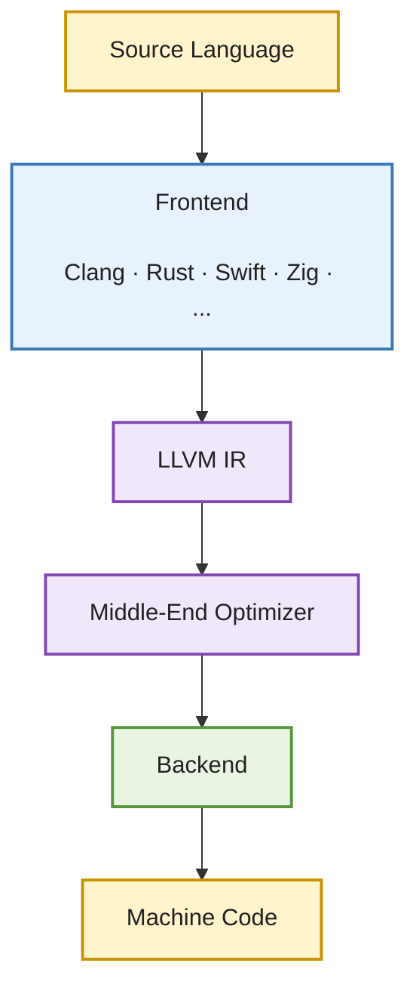

# **Inside LLVM: Engineering a Target-Independent Compiler**

## **Why LLVM Exists**

### **From Many Compilers to One Infrastructure**

---

## 1. The Question

Imagine it is the late 1990s. You form part of a team that has built a successful compiler for a
single programming language targeting a single processor architecture. The system is well
understood, the optimizer is producing good code, and the backend reliably emits binaries 
for your target machine.

Then the requirements change.

A second programming language needs to be supported. Soon after, a new processor architecture becomes
commercially important. Before long, customers expect support for multiple languages, multiple operating
systems, and an ever-growing range of processor families.

You get in the business of supporting infrastructure.

At this point, the problem is no longer writing a **compiler**. The problem is maintaining **an ecosystem of compilers** 
that all need the same optimizations, the same bug fixes, and the same engineering improvements.

**Is it possible to have a compiler infrastructure that supports dozens of programming languages and dozens of processor architectures? 
How will it tame such complexity?**


Before we examine any data structure, optimization pass, or backend interface, it makes sense to understand the engineering
problem that forced LLVM into existence. 
Modern LLVM is best understood as a response to a scaling problem that
traditional compiler architectures could not solve.

---

## 2. The Limitation

A traditional compiler is often presented as a simple linear pipeline.

For a compiler supporting one language and one architecture, this design works remarkably well. Every phase
is built specifically for that single combination, allowing the implementation to be tightly integrated.
The difficulties begin when either side of the pipeline grows.
Suppose we wish to support five programming languages targeting three processor architectures.


```text
                
Languages                  
|---C                         Targets
|---C++                        
|---Rust               x86       ARM      RISC-V
|---Swift                |________|_________|
|---Zig              

5 Languages × 3 Architectures = 15 compiler combinations
```

Without a shared infrastructure, every combination requires its own compilation pipeline.
If more languages and architectures are added, the amount of duplicated engineering effort 
grows rapidly.

This phenomenon is commonly known as the **N × M problem**.

The difficulty extends far beyond parsing source code or generating machine instructions. 
Every compiler benefits from sophisticated analyses and optimizations: dead code elimination,
loop optimizations, common subexpression elimination, function inlining, register allocation,
instruction scheduling, and many others.

In a traditional architecture, improvements to these algorithms often had to be implemented repeatedly 
across multiple compiler implementations. The same optimization might exist in several slightly different
forms, each evolving independently, each accumulating its own bugs and maintenance costs.


The traditional architecture therefore suffered from two fundamental scaling problems:

1. **The N × M problem** — every new frontend or backend increases the number of compiler combinations that must be maintained.
2. **A non-reusable middle** — the most sophisticated and valuable parts of a compiler, namely its analyses and optimizations, could not easily be shared across languages or architectures.

As software development expanded beyond a handful of languages and processor families,
these problems became increasingly expensive. The challenge was no longer writing compilers
— it was preventing compiler engineering effort from growing exponentially.

---

## 3. The New Abstraction

While LLVM IR is a critical component of the infrastructure, I would argue that
LLVM's most significant innovation was **not** the IR[^1].

Its most significant innovation was architectural.

Rather than treating a compiler as a single executable that performs every stage internally, LLVM treats a compiler as **a collection of reusable libraries**.

The resulting architecture appears deceptively simple:



The frontend becomes responsible for understanding a programming language and translating it into LLVM IR.
The middle-end performs analyses and optimizations without needing to know which language produced the IR.
The backend translates that optimized IR into machine code for a specific processor architecture.

A new language no longer needs to build its own optimizer.
A new processor architecture no longer needs to implement an entire compiler.
Instead, both become clients of a common infrastructure.

It is important to understand what LLVM **does not** solve.

LLVM does not eliminate the complexity of supporting multiple languages or multiple architectures.
A frontend must still understand the syntax and semantics of its source language, and every backend
must still understand the instruction set, calling conventions, and ABI of its target processor.

What LLVM eliminates is the repeated implementation of everything that lies between those two ends.

The optimizer, analyses, large portions of the code-generation pipeline, and numerous supporting libraries become shared infrastructure rather than duplicated engineering effort.

This is the first and most fundamental abstraction in LLVM:

> **The compiler is no longer a monolithic program. It is a collection of reusable components connected through carefully designed interfaces.**

---

## 4. How It Works

LLVM's architecture is reflected directly in the structure of the project itself.

At the top level of the repository are independent components rather than a single "compiler" directory.

* `llvm/` — the reusable core libraries, including LLVM IR, analyses, transformations, code generation, target descriptions,
*  the MC layer, and TableGen.
* `clang/` — one frontend among many.
* `lld/` — the linker.
* `compiler-rt/` — runtime support libraries required by generated programs.
* `libcxx/`, `libcxxabi/`, and related projects — the C++ standard library implementation and supporting runtime components.

This organization reflects LLVM's philosophy.
The optimizer is not owned by Clang.
The backend is not owned by Clang.
The IR is not owned by Clang.
Instead, Clang is itself a client of LLVM's libraries, just as a JIT compiler, a static compiler, a binary translator, 
or a research tool can be.

The pipeline shown earlier therefore represents more than compilation stages.

Each boundary represents a **library interface** designed to isolate one class of variation from another.

---

## 5. Why These Boundaries Exist

A recurring theme throughout this series is that LLVM introduces a new abstraction only when an existing one can no longer contain complexity.

Programming languages evolve independently from processor architectures.

A language designer may introduce new type systems, ownership models, generics, or concurrency features without changing anything about modern CPUs.

Likewise, processor architects continue to develop wider vector units, new instruction sets, and increasingly sophisticated microarchitectures without any knowledge of Rust, Swift, or C++.

LLVM deliberately separates these two axes of variation.

The boundary between the frontend and the optimizer isolates language-specific complexity.

The boundary between the optimizer and the backend isolates hardware-specific complexity.

Rather than allowing these differences to permeate the entire compiler, LLVM confines each category of variation behind a dedicated interface.

Every major abstraction introduced later in this series follows exactly the same design philosophy.

---

## 6. Design Trade-offs

Library boundaries are not free.

Every reusable interface must be expressive enough to satisfy many clients without becoming so general that meaningful optimization becomes impossible.

LLVM IR must simultaneously support Clang, Rust, Swift, Julia, Zig, and many other frontends while remaining suitable for aggressive optimization.

Likewise, backend interfaces must describe processors ranging from small embedded microcontrollers to large server CPUs and GPUs.

Designing these interfaces therefore becomes an exercise in balance.

Interfaces that are too narrow cannot accommodate new languages or architectures.

Interfaces that are too broad lose precision and become increasingly difficult to optimize effectively.

Much of LLVM's evolution can be understood as the continuous refinement of these interfaces.

The project deliberately accepts additional compile-time complexity and larger libraries in exchange for dramatically lower long-term engineering cost and substantially greater code reuse.

---

## 7. The Abstraction Leaks

Even at this highest level the abstraction is imperfect.

Target independence is an objective rather than an absolute guarantee.

Certain information about the target machine must already be available while LLVM IR is being generated. Calling conventions, data layouts, pointer sizes, address spaces, and other architectural properties influence the correctness of generated programs.

Consequently, LLVM provides carefully controlled mechanisms through which target-specific knowledge flows into otherwise target-independent components.

These leaks are not failures of the design.

They are examples of a recurring engineering principle that appears throughout LLVM:

> **Good abstractions isolate complexity; they do not pretend that complexity no longer exists.**

---

## 8. Source Tour

The top-level structure of the LLVM project already reveals its architectural philosophy.

* `llvm/` — reusable compiler infrastructure.
* `clang/` — one frontend built on that infrastructure.
* `lld/` — the linker.
* `compiler-rt/` — runtime libraries.
* `libcxx/` and related projects — standard library components.

Notice what is absent.

There is no directory that simply contains "the compiler."

Instead, there is a collection of interoperable components that can be assembled in different ways depending on the needs of the tool being built.

---

## 9. Looking Ahead

We now understand **why** LLVM was organized as a collection of reusable libraries.

That naturally leads to a deeper question.

If dozens of programming languages are expected to share a single optimizer, **what common language do they all speak?**

The answer is **LLVM IR**.

Far more than an intermediate representation, LLVM IR is the central contract around which the entire LLVM ecosystem is built. It is expressive enough to represent a wide variety of source languages, yet constrained enough to enable powerful, target-independent optimizations.

In Part 2, we will examine why abstract syntax trees are insufficient, why raw assembly is insufficient, and how LLVM IR was engineered to occupy the narrow but crucial space between them.

---

## Design Principle #1 — Isolate variations

> **When different parts of a system evolve for different reasons, separate them behind a stable interface.**[^2]
>
> Programming languages and processor architectures evolve independently. LLVM's first architectural decision was to isolate those two axes of change so that new languages and new targets could reuse the same optimization and code-generation infrastructure. Every major abstraction introduced later in LLVM is an extension of this same principle.

---

### **Series Thread**

> **Every abstraction in LLVM exists because the previous one could not adequately contain a particular form of complexity.**
>
> The traditional monolithic compiler could not solve the **N × M scaling problem**. LLVM's first abstraction—treating the compiler as a collection of reusable libraries—was introduced to solve exactly that problem. Every subsequent layer in the series will reveal another engineering challenge, another abstraction, and another carefully chosen boundary.


[^1]: Joran Dirk Greef [may disagree with me on this](https://www.youtube.com/watch?v=yKgfk8lTQuE&t=2793s&pp=ygUZdGhlIHBvd2VyIG9mIGFuIGludGVyZmFjZQ%3D%3D).
[^2]: One thing that is observable in hardware/sotware interface, any time one encounters a relatively radical idea, chances are a new functional unit is involved.
