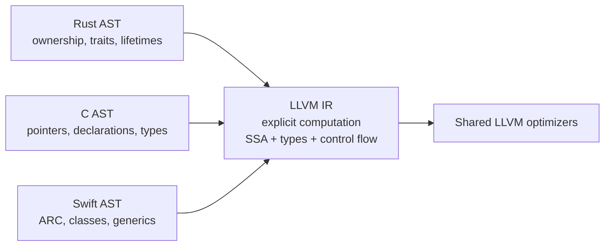
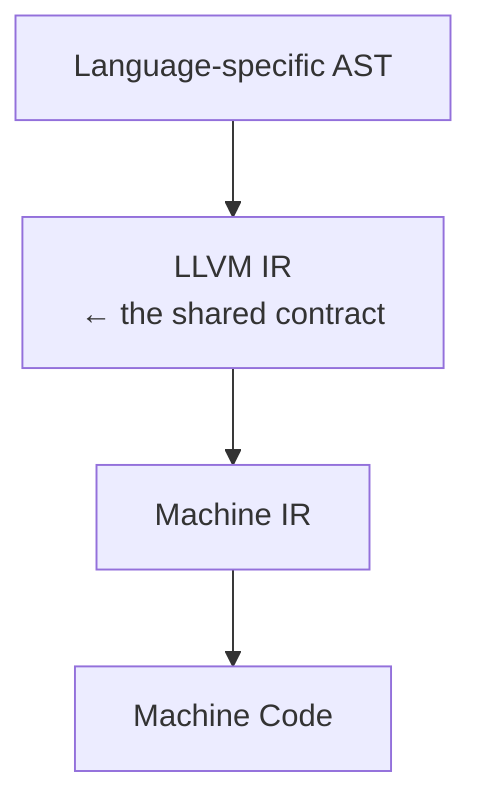
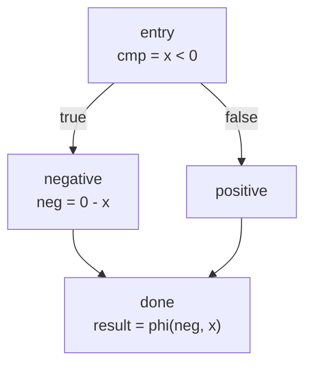
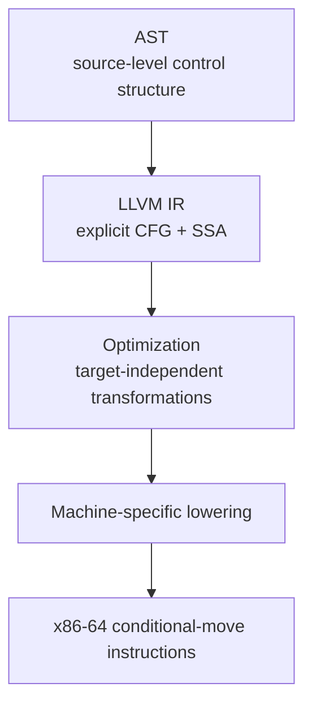

**Inside LLVM: Engineering a Target-Independent Compiler**  
**Part 2 — LLVM IR: Designing a Universal Contract**  
**The Interface Between Languages and Machines**

### 1. The Question

In Part 1 we established why LLVM was organized as a collection of reusable libraries.
The primary objective was to find a way to at least reduce the need to always reinvent the wheel.
A new language no longer needs to invent its own optimizer, and a new architecture no longer needs to reimplement an entire compiler.

That architecture, however, rests on a single, critical assumption:

The existence of a common representation that every frontend can produce and
that the shared optimizer and backends can consume.(so the IR is load bearing to its success)
In the absence of such a representation, the library boundaries described in
Part 1 would be meaningless. Each frontend would still be forced to speak a private language to the rest of the system.

The central question of this article is therefore:

**How can Clang, Rust, Swift, Zig, and many other languages all feed the same optimizer?**

The answer is LLVM IR — a carefully engineered software contract.

### 2. The Limitation

Two natural candidates already existed long before LLVM.

(a). **Abstract Syntax Trees** preserve almost everything a frontend knows about the source program: 
syntactic structure, types, scopes, and language-specific semantics. They are excellent for language-specific
analysis and transformation. They are poor candidates for a shared abstraction.
Their use results to a fragile interface that proves constricting to language designers
(There are only so many language grammars a single AST can represent).

An AST for Rust's ownership and borrowing rules has little in common with an AST for C's 
unchecked pointers or Swift's reference counting. An optimizer written against one would be 
nearly useless for the others. The N × M problem would simply reappear at the level of tree walks and type checkers.

Consider:

```c
int add_one(int x) {
    return x + 1;
}
```

At the source/AST level, the compiler still sees language concepts:

```text
FunctionDecl
└── name: add_one
    return type: int
    parameter:
        └── x : int
    body:
        └── ReturnStmt
            └── BinaryOperator '+'
                ├── DeclRefExpr: x
                └── IntegerLiteral: 1
```
It knows that this is a C function, that `x` is an `int`, that `+` is a source-level 
addition expression, and that the expression is the operand of a `return`.

Note: This example may not clearly illustrate the advantages of LLVM IR over ASTs
because of the stable way in which function structures are conceptualized across different 
languages. But try thinking of language specific contexts. For instance, the various ways in which 
object oriented languages model shared behavior. (Just pick a language specific context)

In contrast, LLVM IR has deliberately forgotten most of that:

```llvm
define i32 @add_one(i32 %x) {
entry:
  %add = add i32 %x, 1
  ret i32 %add
}
```

There is no `ReturnStmt`, no `BinaryOperator` AST node, and no C-specific notion of an `int` declaration.
This means the constrain to neccessarily use the return keyword is lifted.(Of course, the space with
which one can describe what it means for a function to have a return value is limited but
at least it affords the authors a way to describe what it means for a function to have a return 
value without being tied to a keyword or notation).

Programming languages are avenues to think about what is underneath.

The important point is not that LLVM IR contains *less information*. It contains **different information**: source-language structure has been replaced by explicit computation.

To further illustrate:

Consider a language level construct as:

```rust
fn increment(x: i32) -> i32 {
    x + 1
}
```

The Rust compiler can reason about properties that are meaningful at the Rust level:

```text
Function
├── name: increment
├── parameter: x : i32
├── return type: i32
└── expression:
    └── Add
        ├── x
        └── integer literal 1
```

The AST can also retain language-specific information such as:

```text
ownership
borrowing
lifetimes
generic parameters
traits
pattern matching
source locations
visibility
attributes
```

An optimization pass that has to generalise across mulitple target architectures has no need 
to grasp the language-specific details of the source code.


(b). **Raw assembly or machine code** sits at the opposite extreme. It is already target-specific. Register names,
instruction encodings, calling conventions, and ABI details are baked in. An optimizer working at this level
cannot be shared across architectures, and many high-level opportunities (inlining across language boundaries,
high-level loop transformations, language-independent alias analysis) have already been lost.

What was missing was a representation that is:

- low enough to model real computation efficiently,
- high enough to support powerful, language-independent optimizations,
- stable enough to serve as a long-lived interface between many independent projects.

Neither ASTs nor assembly satisfied that combination of requirements. A new abstraction was required[^1].

### 3. Enter LLVM IR

<div align="center">


</div>

LLVM IR is that abstraction.

It occupies the narrow design space between language-specific trees and machine-specific code. 
Frontends lower their ASTs into LLVM IR; the middle-end optimizes that IR without knowing which
language produced it; backends later lower the optimized IR into Machine IR and ultimately machine
code.


Consider our initial function after lowering to a target architecture.

LLVM IR:

```llvm
define i32 @add_one(i32 %x) {
entry:
  %add = add i32 %x, 1
  ret i32 %add
}
```

On an x86-64 System V target, the corresponding assembly can be as simple as:

```asm
add_one:
    lea     eax, [rdi + 1]
    ret
```

On AArch64:

```asm
add_one:
    add     w0, w0, #1
    ret
```

On RISC-V:

```asm
add_one:
    addi    a0, a0, 1
    ret
```

The important observation is that the **LLVM IR is the same**, while the machine instructions differ.

The conceptual stack is therefore:



Thus, LLVM IR is deliberately not a programming language in the conventional sense. It is a 
**contract** that defines:

- what values exist,
- how control flows,
- what operations are expressible,
- and what properties the optimizer may rely upon.

Once a frontend has emitted valid LLVM IR, it has fulfilled its primary obligation to the rest of the infrastructure.

### 4. The IR structure

Before we get to describing the structure consider the following instance:

```c
int abs_value(int x) {
    if (x < 0)
        return -x;
    return x;
}
```

The AST expresses the source structure:

```text
Function
└── IfStmt
    ├── condition: x < 0
    ├── then:
    │   └── return -x
    └── else:
        └── return x
```

The LLVM IR representation of the `abs_value` function makes the control-flow structure explicit:

```llvm
define i32 @abs_value(i32 %x) {
entry:
  %cmp = icmp slt i32 %x, 0
  br i1 %cmp, label %negative, label %positive

negative:
  %neg = sub i32 0, %x
  br label %done

positive:
  br label %done

done:
  %result = phi i32 [ %neg, %negative ], [ %x, %positive ]
  ret i32 %result
}
```

Now the optimizer can see an explicit control-flow graph:



The `phi` instruction is important here. It represents the SSA value selected
according to which predecessor block was taken. LLVM's language reference 
specifies `phi` precisely in terms of the predecessor blocks of the current basic block.

This is something an optimizer benefits from having **explicitly represented** rather than having to 
rediscover from source-level syntax.

The previous IR contains two control-flow paths.

But the optimizer may recognize that the computation can be expressed using a conditional move or equivalent target instruction.

Conceptually:

```text
        x < 0 ?
       /       \
    -x           x
       \       /
          result
```

On x86-64, one possible optimized result is:

```asm
abs_value:
    mov     eax, edi
    neg     eax
    cmovns  eax, edi
    ret
```

So to further refine the nature of the pipeline, what we currently have is;




At the heart of the IR are a small number of interlocking concepts.

**Values, Users, and Use-Def Chains**  
Every computed result is a `Value`. Every place that consumes a value is a `User`. The edges between them
form use-def and def-use chains. These chains are the primary data structure that almost every analysis and
transformation walks. Because the IR is in SSA[^2] form, each value has a single definition, which
dramatically simplifies many algorithms.

**Modules, Functions, Basic Blocks, and Instructions**  
A `Module` is the top-level container (roughly a translation unit). It contains `Function`s. 
Each function contains `BasicBlock`s. Each basic block contains a linear sequence of 
`Instruction`s that ends in a terminator. This hierarchical structure gives optimizers clear units
of work and clear control-flow graphs.

**The Type System**  
LLVM IR is strongly typed. Integer types of arbitrary bit width, floating-point types, pointers, arrays,
structs, vectors, and function types are all first-class. The type system is deliberately low-level; 
it does not encode high-level language notions such as classes, ownership, or generics. Those concepts must
be lowered by the frontend.

**DataLayout**  
While the IR tries to remain target-independent, the physical layout of data cannot be ignored. The `DataLayout`
string describes pointer sizes, alignment rules, endianness, and related properties. It is the first controlled leak
of target information into the "target-independent" IR.

**Attributes, Metadata, and Calling Conventions**  
Function and parameter attributes, metadata nodes, and explicit calling-convention annotations provide the additional 
channels through which frontends and targets communicate information that does not belong in the core instruction set
(inlining hints, aliasing properties, debug information, exception-handling tables, etc.).

Together these mechanisms form a complete, self-contained intermediate language that is stable enough to serve as a
binary interface (bitcode) and expressive enough for serious optimization.

### 5. Design Trade-offs

LLVM IR must satisfy two opposing pressures simultaneously.

It must be **high enough** that the same optimizer can improve code originating from very different languages. 
High-level information that has been needlessly discarded cannot be recovered later.

It must be **low enough** that the eventual mapping to real hardware remains efficient. An IR that is too abstract 
forces the backend to re-discover facts that should have been explicit.

The design therefore makes a series of deliberate choices:

- SSA form is required. This simplifies optimization at the cost of making the IR harder to emit directly 
  from some frontends.
- The type system is structural and relatively simple. Rich language type systems must be erased or encoded explicitly by 
  the frontend.
- Control flow is explicit and unstructured (basic blocks + terminators) rather than structured. This makes many analyses 
  uniform at the cost of losing surface syntax.
- Side effects, memory, and concurrency are modeled with a relatively small set of primitive instructions plus attributes 
  and metadata.

These decisions are not inevitable; they are engineering judgments about which complexities belong in the shared middle 
and which complexities should be pushed into frontends or backends.

### 6. The Abstraction Leaks

Even though LLVM IR is presented as target-independent, several forms of target knowledge already appear inside it:

- **DataLayout** — pointer size, ABI alignment, endianness.
- **Target Triple** — identifies the intended architecture, vendor, and operating system.
- **Calling conventions** — encoded as attributes because different platforms pass arguments differently.
- **Address spaces** — required for some architectures and for certain language features (e.g., GPU memory spaces).
- **Atomic memory operations** — whose precise semantics can depend on the target’s memory model.

These are not accidental impurities. They exist because a purely target-agnostic IR would force either incorrect code or 
an explosion of complexity in every backend. LLVM’s pragmatic stance is that a small, well-documented set of target facts 
may appear early, provided the great majority of optimization remains independent of any particular ISA.

The presence of these leaks reinforces a principle already stated in Part 1: good abstractions isolate complexity; they
do not pretend the complexity has vanished.

### 7. Source Tour

The core IR implementation lives in two tightly related locations:

- `llvm/include/llvm/IR/` — public headers defining `Module`, `Function`, `BasicBlock`, `Instruction`, `Value`, `Type`, `DataLayout`, attributes, metadata, and related classes.
- `llvm/lib/IR/` — the corresponding implementations, including the bitcode reader/writer, the assembler/disassembler for 
  the textual IR, and the core data structures that maintain use-def chains.

When reading this code, notice how little of it knows about any particular programming language or processor. That ignorance 
is intentional; it is exactly what allows the same libraries to be reused by many clients.

### 8. Looking Ahead

We now have a common language that many frontends can speak and that a shared optimizer can understand. The next engineering question
is immediate:

Once a program has been expressed in LLVM IR, how should a collection of independent analyses and transformations be organized so 
that they remain composable, reusable, and largely target-independent?

That question leads directly to the Pass Manager and the middle-end contract — the subject of Part 3.

### Design Principle #2 — Define a Stable Intermediate Contract

When many independent producers and consumers must cooperate, introduce a narrow, well-specified intermediate representation
that both sides can rely upon.
ASTs were too language-specific. Assembly was too machine-specific. LLVM IR was introduced to occupy the space between them and thereby make the library-based architecture of Part 1 possible. Every later abstraction in LLVM builds on the existence of this contract.

### Series Thread

As previously stated or at least hinted at, every abstraction in LLVM exists because the previous one could not adequately contain 
a particular form of complexity.
The traditional monolithic compiler could not solve the N × M scaling problem → LLVM introduced the compiler-as-libraries abstraction (Part 1). 
ASTs and assembly could not serve as a shared medium between many languages and many targets → LLVM introduced LLVM IR as the universal 
contract (Part 2).

The next layer will confront a new problem: how to organize dozens of independent optimizations so that they remain maintainable and reusable across all the languages that now speak this common IR.

[^1]: More information can be found from [Lattner's thesis](https://llvm.org/pubs/2005-05-04-LattnerPHDThesis.pdf) and the [LLVM documentation](https://llvm.org/docs/).
[^2]: [SSABook](https://pfalcon.github.io/ssabook/latest/book-full.pdf)
