# Pliron-HW: A Multi-Level Hardware IR Stack for Spade and Rust-Based Hardware Tools

**Authors / Proposers**
Reginald Ojunga

**Date**
14 August 2026

**Status**
Draft for discussion

---

## 1. Executive Summary

Spade is a modern, strongly typed hardware description language with explicit support for hardware-oriented abstractions such as entities, pipelines, latency, and strongly typed bit-level operations. Its compiler currently lowers Spade programs to SystemVerilog, providing a practical and effective implementation path.

However, as hardware compiler infrastructure grows, there is an opportunity to introduce a reusable hardware-oriented intermediate representation between the Spade compiler and RTL emission.

This proposal introduces **Pliron-HW**, a Rust-native, multi-level hardware IR stack built on Pliron and initially designed as a backend for Spade.

The project is inspired by the architectural approach demonstrated by CIRCT: hardware compilation benefits from separating structural hardware, combinational logic, sequential state, pipeline structure, and output-language constructs into distinct but interoperable IR levels. CIRCT currently provides this separation through dialects including `hw`, `comb`, `seq`, `sv`, and `pipeline`.

Pliron-HW would investigate whether the same general architectural approach can be implemented effectively in a Rust-native compiler infrastructure and integrated directly with a Rust-based HDL such as Spade.

The immediate objective is **not to reproduce CIRCT or replace it**. The objective is to establish a focused, reusable hardware compiler middle-end for Spade, while creating an IR that can eventually be targeted by other Rust-based hardware tools.

---

## 2. Motivation

The current Spade compilation model is effective:

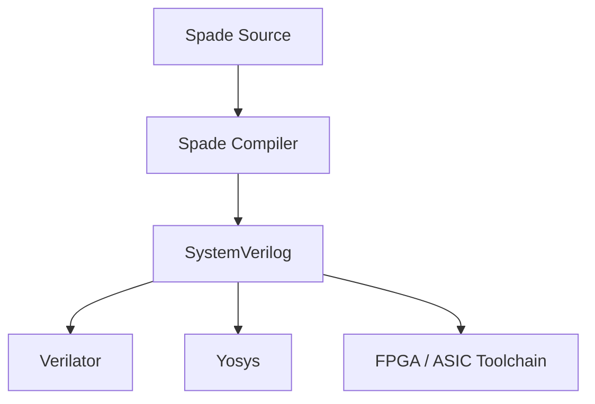

The limitation is that reusable hardware transformations are closely tied to the existing compilation pipeline and final RTL representation.

A dedicated hardware IR would introduce a reusable middle layer:

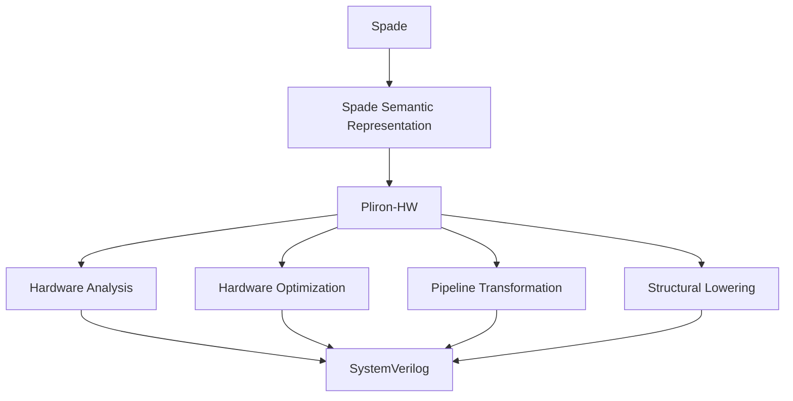

This separation makes hardware transformations independent of both the Spade surface language and the final SystemVerilog representation.

The resulting IR could also provide a common target for future hardware generators, DSLs, HLS experiments, and other Rust-based hardware tools.

---

## 3. Why Pliron?

Pliron is an extensible compiler IR framework implemented in Rust and inspired by MLIR. Its infrastructure provides operations, types, attributes, regions, analyses, verification, parsing, and related compiler IR facilities.

Recent projects such as NVIDIA's cuda-oxide demonstrate that Pliron can participate in a substantial Rust-native compiler pipeline.

The relevant architectural model is:

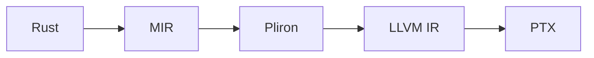

cuda-oxide is currently an experimental/early-alpha project, so it should not be treated as evidence of production maturity. Nevertheless, it demonstrates a relevant use case for Pliron as a Rust-native intermediate representation.

Pliron is therefore a promising substrate for investigating a hardware IR without introducing the C++/MLIR dependency stack into the Spade compiler.

The proposal is consequently not based on the claim that Pliron should replace CIRCT. Rather, it asks whether the **multi-level hardware IR model demonstrated by MLIR/CIRCT can be adapted effectively to a Rust-native compiler ecosystem.**

---

## 4. Goals

### Primary Goal

Build a usable Pliron-HW backend capable of compiling a representative subset of Spade programs into semantically correct, readable, synthesizable SystemVerilog.

The initial implementation should be capable of serving as an alternative backend to the existing Spade SystemVerilog emitter.

### Secondary Goals

1. Define a clear semantic contract for a reusable hardware IR.
2. Establish progressive lowering between hardware abstraction levels.
3. Provide hardware-specific analyses and optimizations.
4. Preserve source locations and useful debugging information.
5. Maintain compatibility with the existing Swim simulation and synthesis workflow.
6. Keep the IR sufficiently general that other frontends can target it.
7. Establish a foundation for future pipeline, memory, FSM, verification, and dataflow infrastructure.

### Non-Goals

This phase will not attempt to:

* replace the Spade language;
* replace Spade's type checker or frontend;
* achieve CIRCT feature parity;
* implement a complete HLS framework;
* implement physical-design optimization;
* implement a complete formal-verification stack;
* replace Yosys, Verilator, or commercial synthesis tools.

---

## 5. Architectural Model

The proposed architecture is:

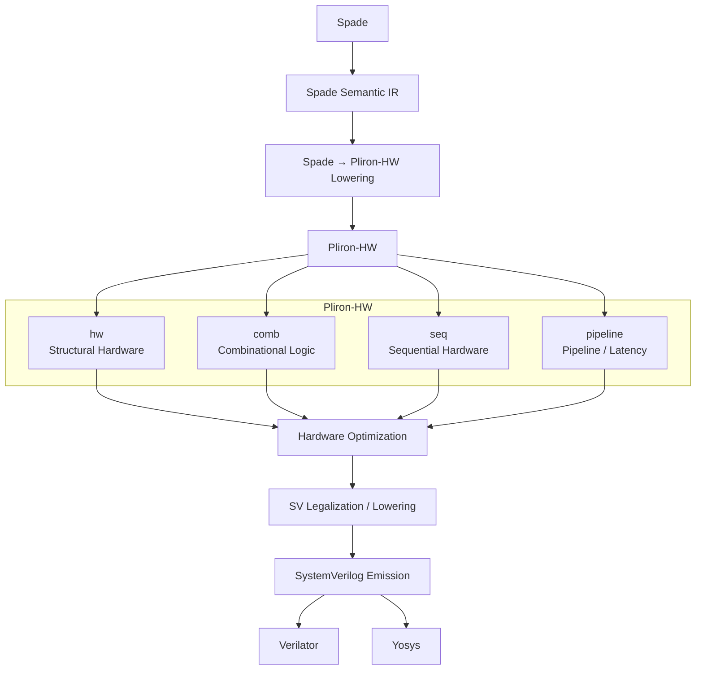

The important design principle is that **SystemVerilog is an output representation, not the primary hardware optimization IR**.

The core hardware representation should remain independent of SystemVerilog wherever practical.

---

## 6. Proposed Dialect Stack

### 6.1 `hw` — Structural Hardware

`hw` provides the structural foundation:

* modules;
* ports;
* instances;
* hierarchy;
* parameters;
* aggregates;
* hardware-level constants;
* structural connections.

Its role is similar to the structural layer provided by CIRCT's HW dialect.

### 6.2 `comb` — Combinational Hardware

`comb` represents stateless hardware operations:

* arithmetic;
* bitwise operations;
* comparisons;
* muxes;
* concatenation;
* extraction;
* extensions and truncation.

The dialect should explicitly define width and signedness semantics rather than inheriting them implicitly from SystemVerilog.

This distinction is important because Spade exposes explicitly sized signed and unsigned integer types and explicit conversions.

### 6.3 `seq` — Sequential Hardware

`seq` represents state and sequential hardware concepts:

* registers;
* register enables;
* clocks;
* resets;
* initialization;
* memories where appropriate.

The design should keep sequential semantics independent of SystemVerilog syntax, following the same general separation used by CIRCT's `seq` dialect.

### 6.4 `pipeline` — Timing and Pipeline Structure

`pipeline` should preserve high-level timing information before it is lowered into explicit registers.

This is particularly important for Spade because pipeline constructs carry explicit latency semantics and the compiler checks relationships between pipeline stages.

The conceptual lowering is:

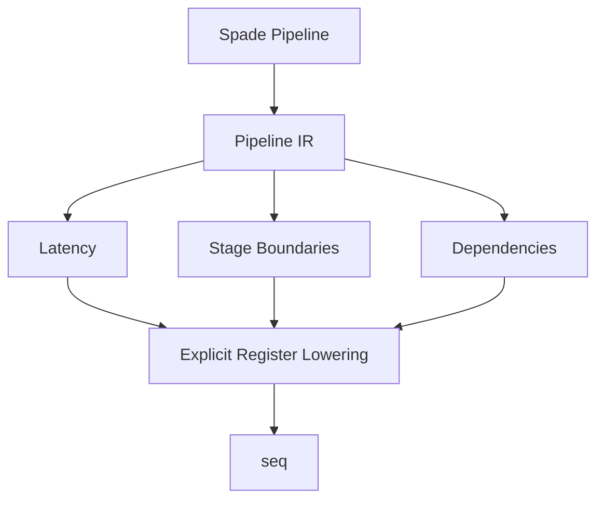

Pipeline scheduling and register insertion should therefore be treated as later transformations rather than immediately encoding all pipeline structure as low-level registers.

### 6.5 `sv` — SystemVerilog-Specific Constructs

`sv` should be introduced only where the output language requires constructs that cannot be represented naturally in the generic hardware dialects.

It may contain:

* procedural constructs;
* SystemVerilog-specific declarations;
* interfaces;
* special emission constructs;
* constructs required for legal SystemVerilog generation.

The final textual SystemVerilog emitter should remain a separate stage.

The intended relationship is:

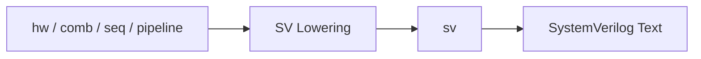

---

## 7. Semantic Contract

Before substantial optimization work begins, Pliron-HW should specify the semantics of its core types and operations.

The specification should cover:

* integer widths;
* signedness;
* truncation;
* zero/sign extension;
* overflow behavior;
* bit ordering;
* aggregate layout;
* combinational purity;
* register behavior;
* clock semantics;
* reset semantics;
* initialization;
* register enables;
* pipeline latency;
* memory semantics;
* hierarchy and instance semantics.

This semantic contract is a prerequisite for reliable lowering from Spade and for allowing independent frontends to target Pliron-HW.

---

## 8. Spade Integration

The first integration should preserve the existing Spade frontend.

Spade should remain responsible for:

* parsing;
* name resolution;
* type checking;
* generic elaboration;
* language-specific diagnostics;
* Spade-specific semantic checks.

Pliron-HW should become responsible for:

* hardware representation;
* hardware analysis;
* hardware optimization;
* pipeline transformation;
* structural lowering;
* RTL generation.

The initial compiler architecture would therefore be:

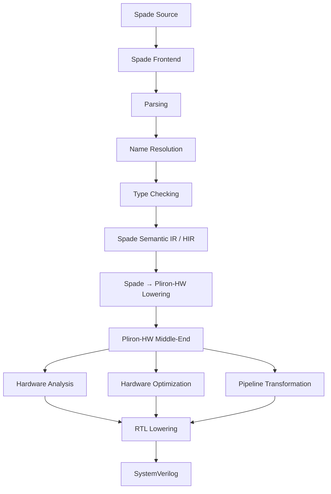

The existing SystemVerilog backend should remain available during development:

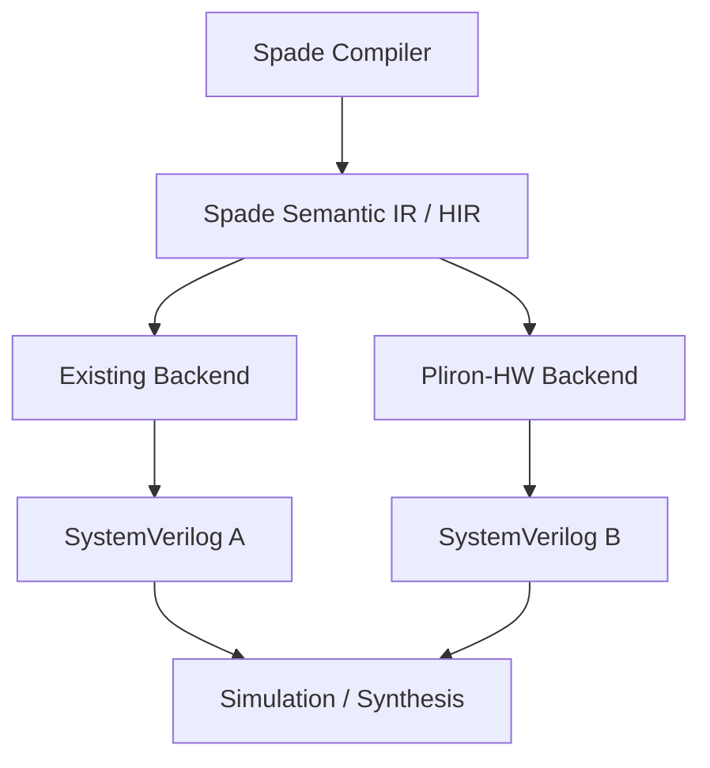

This provides a reference implementation against which the new backend can be validated.

---

## 9. Backend Integration with Swim

The new backend should initially be exposed as an experimental compiler option rather than changing the default backend.

For example:

```text
spadec --backend=pliron-hw
```

or an equivalent Swim configuration.

The existing Swim flow should remain unchanged:

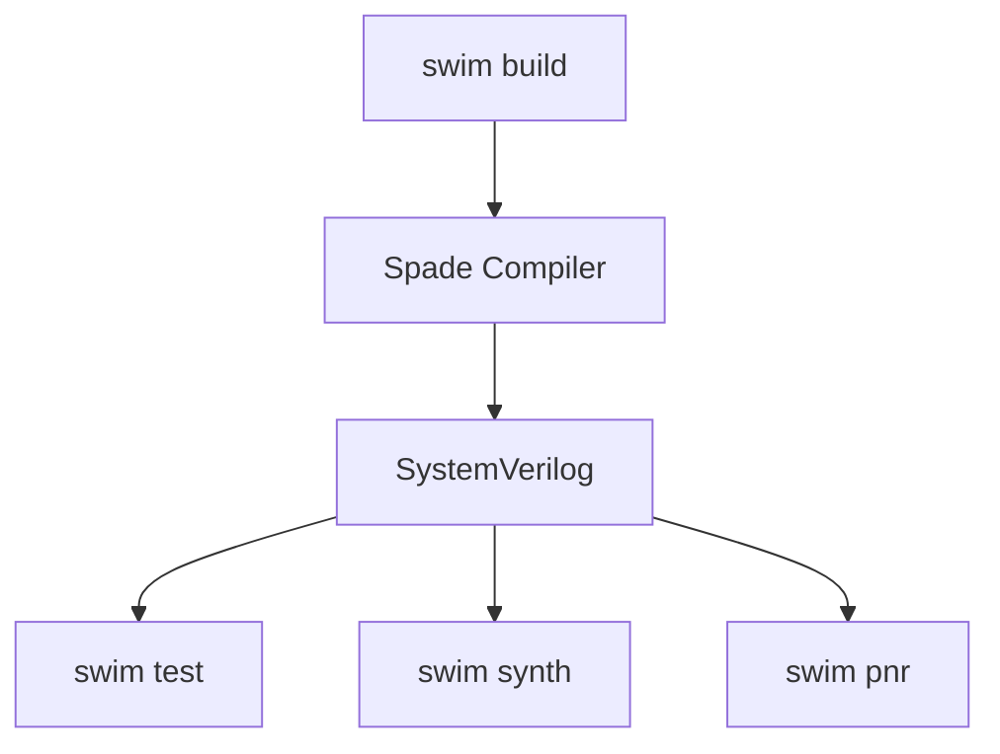

The only change should be which compiler backend generates the SystemVerilog.

This provides a low-risk migration path and allows direct comparison between the existing and Pliron-HW backends.

---

## 10. Optimization Strategy

The first optimization passes should be hardware-oriented rather than merely reproducing generic compiler optimizations.

### Initial Optimizations

* constant folding;
* constant propagation;
* dead signal elimination;
* common subexpression elimination;
* algebraic canonicalization;
* mux simplification;
* bit-width reduction;
* extension/truncation simplification;
* structural simplification.

### Later Optimizations

* mux balancing;
* register optimization;
* pipeline canonicalization;
* range analysis;
* memory transformations;
* resource sharing;
* latency-aware optimization.

The optimization objective should explicitly consider:

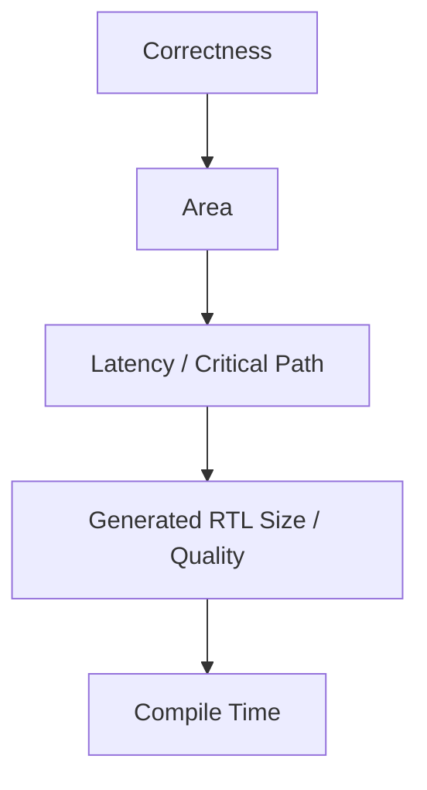

This is more appropriate for hardware than treating the number of IR operations as the primary optimization metric.

---

## 11. Validation Strategy

Correctness should be established through differential testing against the existing Spade backend.

For a given Spade program:

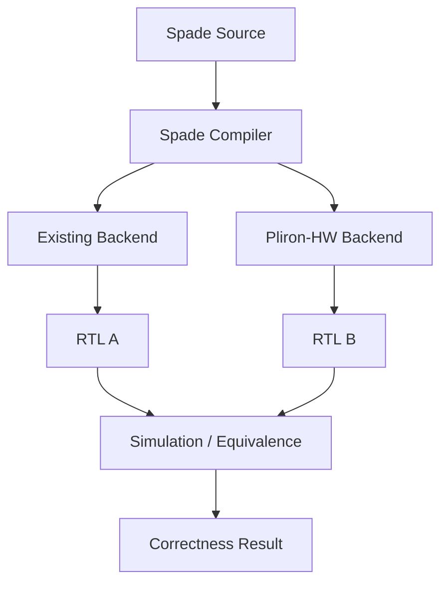

The validation hierarchy should include:

### Level 1 — IR Correctness

* parser round trips;
* verifier tests;
* type checking;
* operation invariants.

### Level 2 — RTL Correctness

* generated SystemVerilog compiles;
* Verilator simulation succeeds;
* Yosys accepts representative designs.

### Level 3 — Differential Correctness

The same Spade programs should be compiled by both backends and compared through simulation and, where practical, formal/equivalence checks.

### Level 4 — Real Designs

Representative examples should include:

* counters;
* UART;
* FIFO;
* WS2812 controller;
* simple CPU pipeline;
* representative Spade projects.

---

## 12. Repository Structure

A possible initial repository layout is:

```text
pliron-hw/
├── crates/
│   ├── pliron-hw/
│   ├── pliron-hw-comb/
│   ├── pliron-hw-seq/
│   ├── pliron-hw-pipeline/
│   └── pliron-hw-sv/
│
├── spade-bridge/
├── tools/
│   └── hw-opt/
│
├── tests/
│   ├── parser/
│   ├── verifier/
│   ├── lowering/
│   ├── optimization/
│   └── end-to-end/
│
└── examples/
```

The exact repository boundaries should be decided with the Pliron and Spade maintainers after the initial prototype.

---

## 13. Milestones

### M0 — Vertical Prototype

**Month 1–2**

Implement the smallest complete path:

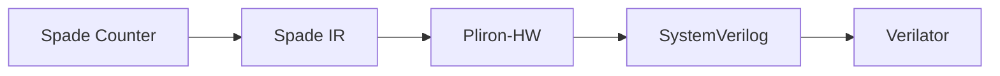

Deliverables:

* initial `hw`;
* minimal `comb`;
* minimal `seq`;
* basic parser/printer;
* verifier;
* SystemVerilog emission;
* counter example.

**Exit criterion:** a real Spade design can pass through the complete pipeline.

---

### M1 — Core Hardware IR

**Month 3–4**

Add:

* module hierarchy;
* instances;
* ports;
* typed constants;
* arithmetic;
* comparisons;
* muxes;
* registers;
* clock/reset semantics;
* source locations.

**Exit criterion:** representative combinational and sequential Spade programs compile successfully.

---

### M2 — Backend Integration

**Month 5–6**

Add:

* automated Spade → Pliron-HW lowering;
* compiler feature flag;
* existing-backend comparison;
* Swim integration;
* differential tests.

**Exit criterion:** a representative subset of the Spade test suite can use the new backend.

---

### M3 — Optimization

**Month 7–8**

Implement:

* constant propagation;
* DCE;
* CSE;
* canonicalization;
* bit-width optimization;
* mux simplification;
* hardware-specific analyses.

**Exit criterion:** optimized generated RTL is demonstrably equivalent to the unoptimized representation and does not regress synthesis quality.

---

### M4 — Pipeline Representation

**Month 9–10**

Add:

* pipeline stages;
* latency representation;
* stage-aware dependencies;
* explicit register lowering;
* initial timing-aware transformations.

**Exit criterion:** representative Spade pipeline designs compile through Pliron-HW while preserving latency semantics.

---

### M5 — Stabilization

**Month 11–12**

Deliver:

* documentation;
* examples;
* performance measurements;
* expanded test suite;
* Swim integration;
* migration guidance;
* design documentation;
* public experimental release.

---

## 14. Success Criteria

The project will be considered successful if:

1. A representative subset of Spade programs can compile through Pliron-HW.
2. Generated SystemVerilog is accepted by Verilator and Yosys.
3. Generated hardware is behaviorally equivalent to the existing Spade backend for the tested designs.
4. Pipeline latency semantics are preserved.
5. Hardware-specific optimizations demonstrate measurable value on representative designs.
6. The compiler remains usable with acceptable compilation overhead.
7. The IR has sufficiently clear semantics and documentation for an independent frontend to target it.
8. The existing Spade backend can remain available as a reference and fallback during the transition.

---

## 15. Risks

### Risk 1 — Semantic Mismatch

Spade may contain semantics that do not map directly onto the initial IR.

**Mitigation:** define the semantic contract first and implement the first vertical slice around a small number of well-understood constructs.

### Risk 2 — Overbuilding the IR

Attempting to reproduce CIRCT's breadth would consume the project before a useful backend exists.

**Mitigation:** focus initially on `hw`, `comb`, `seq`, and the minimum pipeline representation required by Spade.

### Risk 3 — SystemVerilog Leakage

The IR could become an alternative spelling of SystemVerilog rather than a hardware middle-end.

**Mitigation:** keep generic hardware semantics separate from the `sv` layer and make SystemVerilog emission a final lowering stage.

### Risk 4 — Pipeline Complexity

Spade's timing and pipeline semantics may require abstractions beyond simple register insertion.

**Mitigation:** preserve pipeline latency explicitly in the IR before lowering to `seq`.

### Risk 5 — Performance

An additional IR layer could initially increase compile time.

**Mitigation:** benchmark the existing backend against the new backend from the first vertical prototype and optimize the infrastructure only where measurements justify it.

### Risk 6 — Project Fragmentation

A standalone repository could diverge from both Spade and Pliron.

**Mitigation:** establish explicit interfaces and coordinate upstream changes with both projects before committing to long-lived architectural dependencies.

---

## 16. Licensing

Spade's compiler source is currently licensed under EUPL-1.2, while its standard library is licensed under both MIT and Apache-2.0.

The licensing boundary between Pliron-HW and Spade should therefore be established before implementation is merged upstream.

Direct modifications to the Spade compiler must remain subject to the applicable Spade licensing terms. A standalone Pliron-HW implementation should retain an independently selected license compatible with its dependencies and contribution model.

---

## 17. Long-Term Vision

The long-term goal is not simply another SystemVerilog emitter.

The goal is to establish a reusable hardware compiler middle-end:

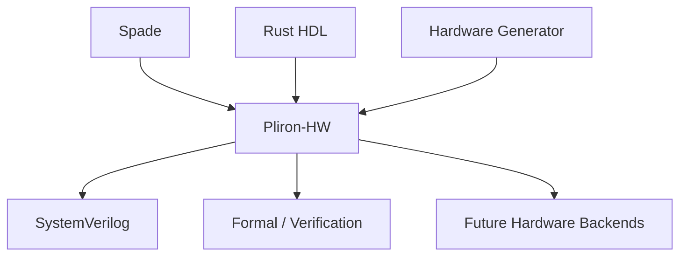

In the longer term, additional frontends could target the same hardware IR:

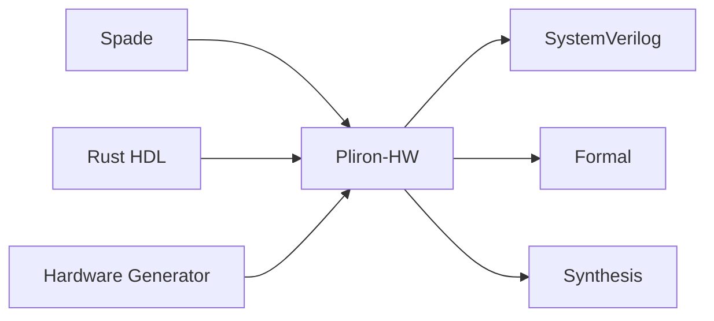

Possible future dialects could include:

* FSM;
* memory;
* handshake/dataflow;
* verification;
* scheduling;
* synthesis.

These should be introduced only when a concrete frontend or transformation requires them.

---

## 18. Immediate Next Steps

1. Review the proposal with Spade maintainers.
2. Review the proposed architecture with Pliron maintainers.
3. Inspect the existing Spade compiler IR and identify the narrowest stable lowering boundary.
4. Implement a minimal `hw`/`comb`/`seq` vertical slice.
5. Compile one real Spade counter through the new backend.
6. Generate SystemVerilog and validate it with Verilator and Yosys.
7. Compare the generated RTL against the existing Spade backend.
8. Use the results of this prototype to finalize the dialect and repository architecture.

The first milestone should therefore be treated as an architectural experiment rather than a commitment to a complete hardware compiler framework.

---

## 19. Conclusion

Pliron-HW proposes a focused investigation into a Rust-native multi-level hardware compiler architecture.

The immediate value is a maintainable alternative backend for Spade. The larger value is the possibility of separating hardware semantics and optimization from both the Spade language and the final RTL representation.

CIRCT demonstrates the effectiveness of this architectural separation at scale. Pliron provides an opportunity to explore a similar model within a Rust-native compiler ecosystem.

The proposed approach deliberately avoids attempting to reproduce CIRCT. Instead, it starts with the smallest useful hardware IR stack, validates it through an end-to-end Spade backend, and expands only where real compiler requirements justify additional abstraction.

The first question is therefore not:

> **"Can we build CIRCT in Rust?"**

It is:

> **"Can a small, well-defined hardware middle-end built on Pliron provide Spade with a cleaner separation between language semantics, hardware optimization, and RTL generation?"**

This proposal argues that the question is both technically feasible and worth investigating.

